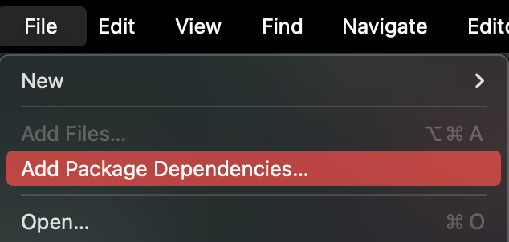
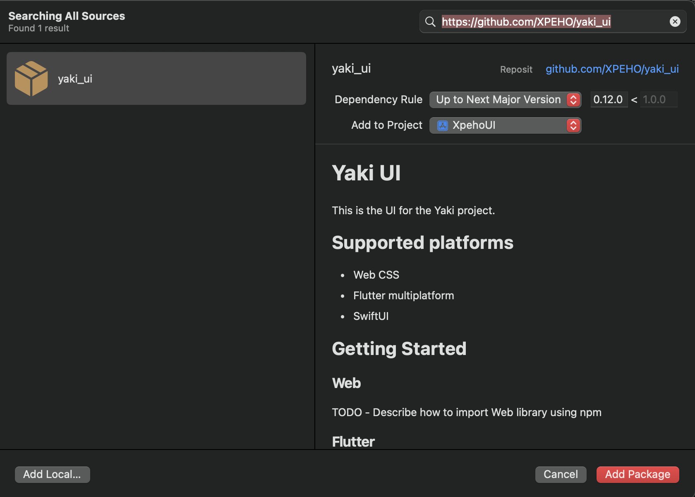

# XPEHO UI

This is the UI for the XPEHO projects in SwiftUI.

## Getting Started

In Xcode click on `File > Add Package Dependencies...`.



In the search bar at the top right corner, type the link [https://github.com/XPEHO/yaki_ui](https://github.com/XPEHO/yaki_ui) and press `Enter` key.



At the bottom right corner of the modal, click on `Add Package` button.

Make sure to add this line at the start of your app to load the fonts used for the components:

```swift
import xpeho_ui

init() {
  Fonts.registerFonts()
}
```

You can use them by yourself in your app using :

```swift
import xpeho_ui

Text("text").font(.rubik(.bold, size: 18))
Text("text").font(.raleway(.bold, size: 18))
Text("text").font(.roboto(.bold, size: 18))
```

As you can see the possible fonts are [Rubik](https://fonts.google.com/specimen/Rubik), [Raleway](https://fonts.google.com/specimen/Raleway) and [Roboto](https://fonts.google.com/specimen/Roboto) from Google Fonts.

Moreover, you can used the images of the design using :

```swift
import xpeho_ui

Assets.loadImage(named: "ImageName")
```

The possible images can be viewed in the package's [Assets.xcassets](Sources/xpeho_ui/Resources/Assets.xcassets) and their names are as follows:

- 3dots
- Account
- AddPlus
- Anchor
- Arrow-down
- Arrow-left
- Arrow-right
- Arrow-up
- Birthday
- Boat
- Briefcase
- BriefcaseYAKI
- BurgerMenu
- Calendar
- Check
- Chevron-down
- Chevron-left
- Chevron-right
- Chevron-up
- ContactFill
- CrossClose
- Edit
- Eye
- Filter
- Gouvernail
- Newsletter
- Placeholder
- PlaneDeparture
- QVST
- Receipt
- Search
- Statistic
- Teams
- Validated

Finally, you can use the colors of the design using the constants directly, they are define in [Utils.swift](Sources/xpeho_ui/Utils/Utils.swift) and the list is :

- XPEHO_COLOR : 
- XPEHO_DARK_COLOR : 
- GREEN_DARK_COLOR : 
- RED_INFO_COLOR : 
- DISABLED_COLOR : 
- CONTENT_COLOR : 
- BACKGROUND_COLOR : 
- GRAY_LIGHT_COLOR : 

## Components

### ClickyButton


**Usage**

```swift
import xpeho_ui

ClickyButton(
    label: "Clicky Button Customized",
    size: 20,
    backgroundColor: .red,
    labelColor: .white,
    thinMode: false,
    isDisabled: false,
    onPress: {
        debugPrint("The button is pressed")
    }
)
```

### InputText


**Usage**

```swift
import xpeho_ui

InputText(
    label: "Input Text Customed",
    hiddenSwitcherIcon: Assets.loadImage(named: "Eye"),
    initialInput: "input",
    labelSize: 15.0,
    inputSize: 20.0,
    labelColor: RED_INFO_COLOR,
    backgroundColor: CONTENT_COLOR,
    inputColor: .white,
    hiddenSwitcherColor: .white,
    isHiddenable: false,
    onInput: { input in
        debugPrint("The input \(input) is typed")
    }
)

```

### ChoiceSelector


**Usage**

```swift
import xpeho_ui

ChoiceSelector(
    label: "Choice Selector Customized",
    choicesAvailable: ["Choice Custom 1", "Choice Custom 2", "Choice Custom 3", "Choice Custom 4", "Choice Custom 5"],
    defaultSelectedChoice: "Choice Custom 1",
    size: 20.0,
    backgroundColor: CONTENT_COLOR,
    choiceColor: .white,
    checkIconColor: .white,
    separatorColor: .white,
    onPress: { choice in
        debugPrint("The choice \(choice) is pressed")
    }
)
```

### CollapsableCard


**Usage**

```swift
import xpeho_ui

CollapsableCard(
    label: "Collapsable Card Customized",
    headTag: "Head Tag",
    tags: ["Tag Customized 1", "Tag Customized 2", "Tag Customized 3", "Tag Customized 4"],
    importantTags: ["Tag Customized 3"],
    buttonLabel: "Action",
    icon: Assets.loadImage(named: "Briefcase"),
    openArrowIcon: Assets.loadImage(named: "Chevron-down"),
    closeArrowIcon: Assets.loadImage(named: "Chevron-up"),
    size: 18.0,
    labelColor: .white,
    backgroundColor: CONTENT_COLOR,
    headTagBackgroundColor: .white,
    headTagLabelColor: RED_INFO_COLOR,
    tagBackgroundColor: .white,
    tagLabelColor: CONTENT_COLOR,
    importantTagBackgroundColor: .white,
    importantTagLabelColor: RED_INFO_COLOR,
    arrowColor: .white,
    iconColor: .white,
    buttonBackgroundColor: RED_INFO_COLOR,
    buttonLabelColor: .white,
    isCollapsable: true,
    isHeadTagVisible: true,
    isButtonVisible: true,
    isDefaultOpen: true,
    onPressButton: {
        debugPrint("The button is pressed")
    }
)
```

### FilePreviewButton


**Usage**

```swift
import xpeho_ui

FilePreviewButton(
    labelLeft: "File Preview Button Customized",
    labelRight: "",
    imagePreview: Assets.loadImage(named: "Placeholder"),
    pillTags: ["Tag Pill Custom 1", "Tag Pill Custom 2", "Tag Pill Custom 3", "Tag Pill Custom 4"],
    arrowIcon: Assets.loadImage(named: "Arrow-right"),
    height: 200,
    labelSize: 20,
    backgroundColor: CONTENT_COLOR,
    labelColor: .white,
    pillBackColor: RED_INFO_COLOR,
    pillLabelColor: .white,
    arrowColor: RED_INFO_COLOR,
    isDisabled: false,
    isLabelsAbove: false,
    onPress: {
        debugPrint("The button is pressed")
    }
)
```

### TagPill


**Usage**

```swift
import xpeho_ui

TagPill(
    label: "Tag Pill Customized",
    size: 20,
    backgroundColor: GREEN_DARK_COLOR,
    labelColor: .white
)
```
